# PocketBrain

PocketBrain is a personal assistant runtime built on Bun + OpenCode, with persistent local state.

## 30-Second Quickstart

### Users / Operators

```bash
cp .env.example .env
# set runtime values in .env
bun install
bun run start
```

Requires Bun 1.3.x+.

### Developers

```bash
bun install
cp .env.example .env
bun run setup
make dev
```

Requires Bun 1.3.x+.

## Project Overview

PocketBrain includes:
- OpenCode SDK integration for model/runtime workflows
- WhatsApp channel adapter (optional)
- SQLite-backed state and memory
- Syncthing-backed vault synchronization
- Operational scripts for setup, runtime, and release

Core runtime process:
- `pocketbrain`: assistant process

## Architecture at a Glance 🗺️

```mermaid
flowchart LR
  User[User 📱] --> WA[WhatsApp Adapter]
  WA --> Core[AssistantCore]
  Core --> OpenCode[OpenCode Runtime]
  Core --> DB[(SQLite state.db)]
  Core --> Vault[(data/vault Markdown)]
  Vault --> Filesystem[(Local Filesystem)]
```



- Full walkthrough: `docs/architecture/system-overview.md`
- Coding architecture: `docs/architecture/coding-architecture.md`
- Repository structure contract: `docs/architecture/repository-structure.md`
- Security model: `docs/architecture/security-threat-model.md`

## Project Data

Default runtime data is stored in `data/`:
- `data/state.db` SQLite state (sessions, memory, whitelist, outbox)
- `data/vault/` synced markdown vault
- `data/whatsapp-auth/` WhatsApp auth state

Environment/config:
- `.env.example` -> copy to `.env`

## Repository Layout

- `src/` application code
- `tests/` automated tests
- `scripts/` setup, runtime, and ops scripts
- `docs/` architecture, setup, deploy, and references
- `.agents/skills/` reusable OpenCode-compatible workflows
- `development/` CI and structure-contract tooling

## Quick Launch (Users / Operators)

Use the 30-second quickstart above for the fastest path.
For full host bootstrap + runtime flow:

```bash
make setup-runtime
cp .env.example .env
# set runtime values in .env
bun install
bun run start
make logs
```

Update runtime:

```bash
git pull
bun install
bun run start
```

## Quick Launch (Developers)

Use the 30-second quickstart above for the fastest path.
For full local setup + validation:

```bash
make setup-dev
cp .env.example .env
bun run setup
make test
make dev
```

## Common Commands

```bash
make test
make build
make start
make logs
make release TAG=$(git rev-parse --short HEAD)
```

## Skills-First Operations

Operational workflows are externalized as skills in `.agents/skills/`.
Skill catalog:
- `docs/setup/agent-skills.md`

## Documentation

- Developer setup: `docs/setup/developer-onboarding.md`
- Runtime deploy: `docs/deploy/debian-runtime-zero-to-deploy.md`
- VPS hardening + run guide: `docs/deploy/secure-vps-and-run-pocketbrain.md`
- Runbooks index: `docs/runbooks/README.md`
