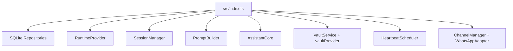
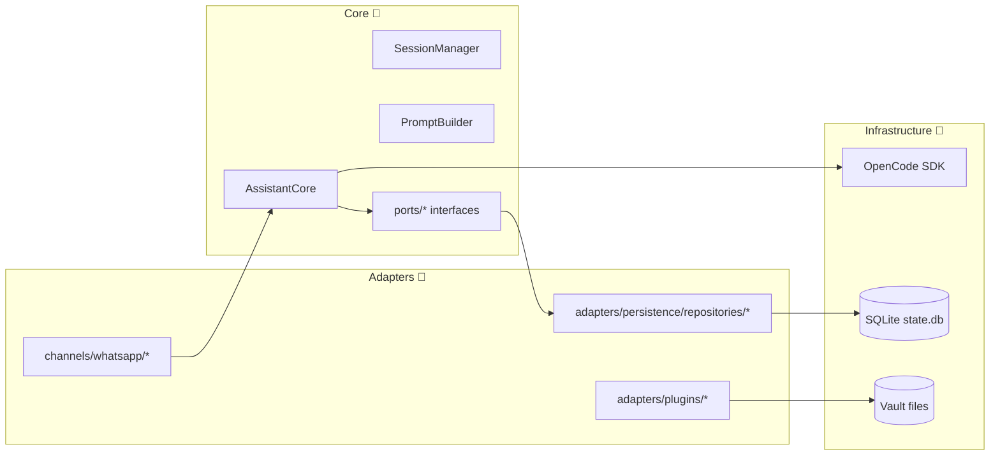
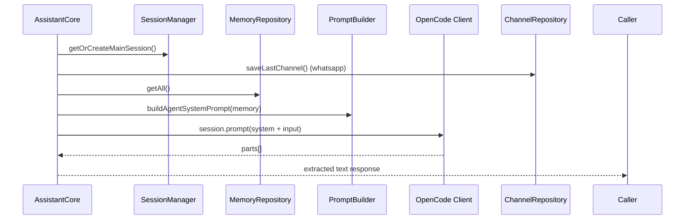
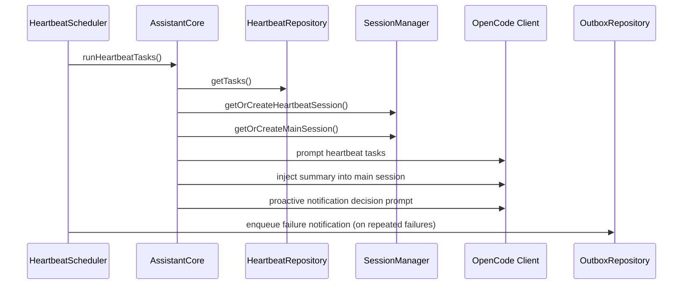
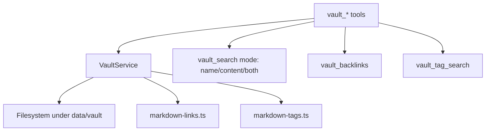
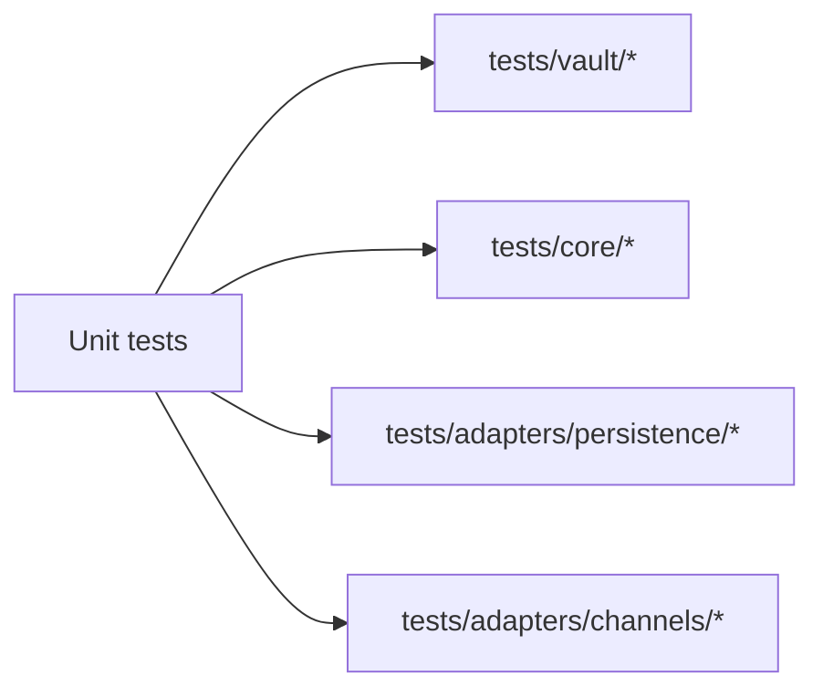

# Coding Architecture Guide 💻

This page explains how the code is structured at module/class level so contributors can jump in fast.

## 1) Composition Root (How the app is wired)

`src/index.ts` is the single composition root.



Why this is good:
- ✅ No hidden global initialization
- ✅ Dependency graph is explicit
- ✅ Easier testing and refactoring

## 2) Core vs Adapters (Port-Adapter Style)



Rule of thumb:
- Core defines behavior/contracts.
- Adapters implement I/O details.

## 3) Chat Request Code Path

Main entrypoint: `AssistantCore.ask()` in `src/core/assistant.ts`.



## 4) Heartbeat Code Path

Heartbeat scheduler lives in `src/scheduler/heartbeat.ts`, execution in `AssistantCore.runHeartbeatTasks()`.



## 5) Vault + PKM Code Path

Vault API surface is in `src/vault/vault-service.ts`; tools are exposed via `src/adapters/plugins/vault.plugin.ts`.



Recent PKM-related code points:
- `searchFiles(query, folder, mode)`
- `findBacklinks(target, folder)`
- `searchByTag(tag, folder)`

## 6) Persistence Model (SQLite)

Schema bootstrap: `src/store/db.ts`.

Main tables:
- `kv` (session IDs, last-channel)
- `memory` (durable facts)
- `whitelist` (channel access)
- `outbox` (proactive queued messages + retry metadata)
- `heartbeat_tasks` (scheduled agent tasks)

## 7) Test Strategy Map 🧪



Command baseline:
```bash
bun run typecheck
bun test
```

## 8) Practical Extension Points

- Add new channel: implement `ChannelAdapter` and register in `src/index.ts`.
- Add new tool/plugin: create under `src/adapters/plugins/` and wire via OpenCode config.
- Add new persistence implementation: implement core port, bind in composition root.
- Add new vault capability: extend `VaultService` first, then expose tool.
