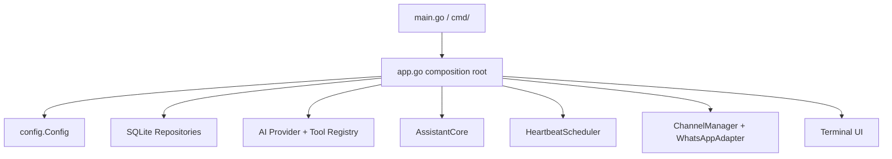
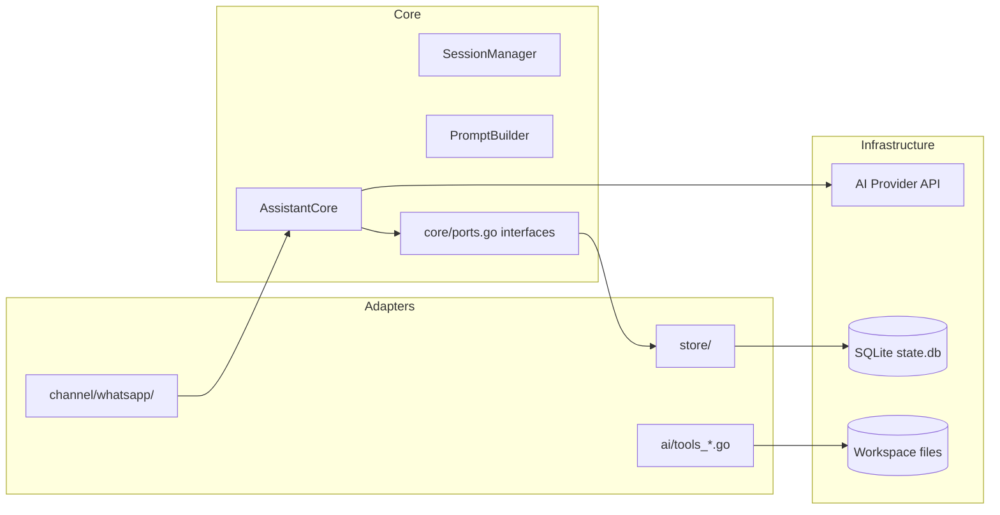
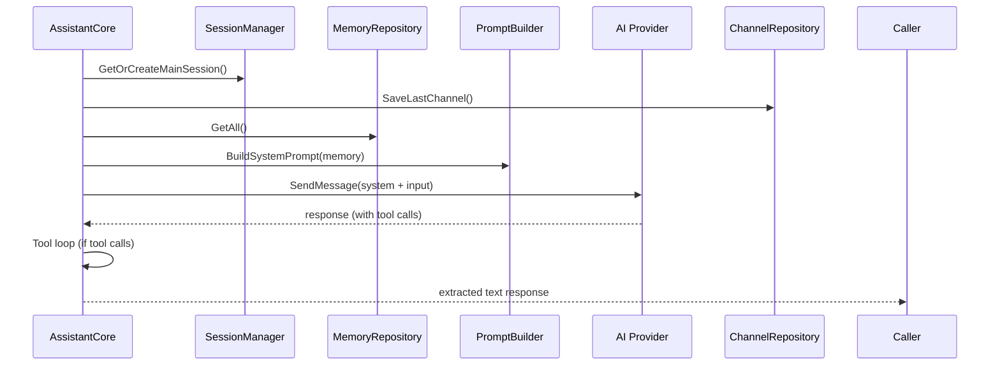
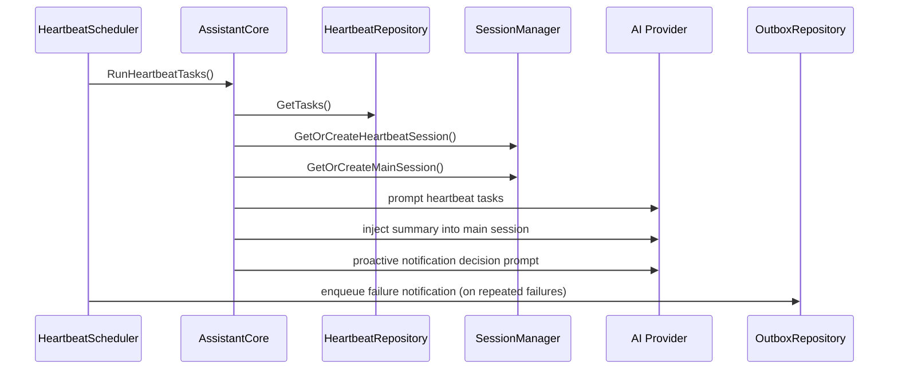
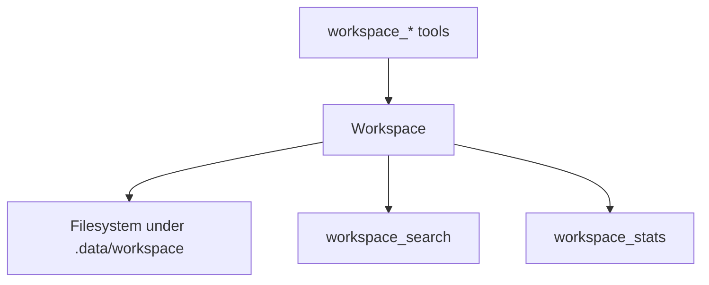

# Coding Architecture Guide

This page explains how the code is structured at package level so contributors can jump in fast.

## 1) Composition Root (How the app is wired)

`main.go` -> `cmd/` (Cobra CLI) -> `internal/app/app.go` is the single composition root.



Why this is good:
- No hidden global initialization
- Dependency graph is explicit
- Easier testing and refactoring

## 2) Core vs Adapters (Port-Adapter Style)



Rule of thumb:
- Core defines behavior/contracts (`internal/core/`).
- Adapters implement I/O details (`internal/store/`, `internal/channel/`, `internal/ai/`).

## 3) Chat Request Code Path

Main entrypoint: `AssistantCore.Ask()` in `internal/core/assistant.go`.



## 4) Heartbeat Code Path

Heartbeat scheduler lives in `internal/scheduler/heartbeat.go`, execution in `AssistantCore.RunHeartbeatTasks()`.



## 5) Workspace Code Path

Workspace operations are in `internal/workspace/workspace.go`; tools are exposed via `internal/ai/tools_workspace.go`.



## 6) Persistence Model (SQLite)

Schema bootstrap: `internal/store/db.go`.

Main tables:
- `session` (session IDs)
- `memory` (durable facts)
- `whitelist` (channel access)
- `outbox` (proactive queued messages + retry metadata)
- `heartbeat_tasks` (scheduled agent tasks)
- `channel` (last-used channel tracking)

## 7) Test Strategy

222+ tests across 11 packages. Test files live alongside source (`*_test.go`).

```bash
go test ./... -count=1        # run all tests
go test ./... -count=1 -race  # with race detection
go vet ./...                  # static analysis
```

No external mocking libraries — all mocks are hand-written stubs in test files.

## 8) Practical Extension Points

- Add new channel: implement `core.ChannelAdapter` (`internal/core/ports.go`), register in `app.go`.
- Add new AI tool: create in `internal/ai/tools_*.go`, register via `ai.Registry`.
- Add new persistence: implement core port interface, bind in composition root.
- Add new workspace feature: extend `workspace.Workspace`, expose via tool.
