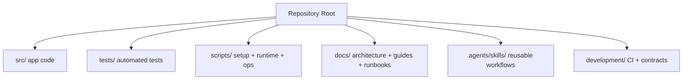

# Repository Structure Contract 🧭

Canonical repository layout for PocketBrain.

## Quick Visual Map

## Top-level folders

### `src/`

Application source code.

### `tests/`

Automated tests for the application.

### `scripts/`

Executable scripts grouped by purpose:
- `setup/` machine/bootstrap setup
- `runtime/` runtime/container boot scripts
- `ops/` release/backup/operational helpers

### `docs/`

Documentation and runbooks only.

### `development/`

Development and CI contract tooling.

### `.agents/skills/`

OpenCode/agent-compatible reusable skills (`SKILL.md` files).

## Placement checklist

1. Is it executable app code? -> `src/`
2. Is it a test? -> `tests/`
3. Is it an operator/setup/runtime script? -> `scripts/`
4. Is it documentation? -> `docs/`
5. Is it reusable agent workflow knowledge? -> `.agents/skills/`
6. Is it CI/repo-contract tooling? -> `development/`

## Command contract

- Repository root is the only canonical working directory.
- `make` is the primary command interface.
- No compatibility wrapper scripts at `scripts/*.sh`.

## Enforcement

- Structure rules are enforced by `development/ci/validate-structure.sh`.
- PRs run `.github/workflows/structure-contract.yml`.
