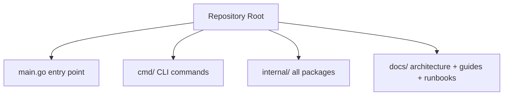

# Repository Structure Contract

Canonical repository layout for PocketBrain.

## Quick Visual Map



## Top-level layout

```
main.go              entry point
go.mod / go.sum      Go module definition
cmd/                 CLI commands (cobra)
internal/            all application packages
  ai/                AI providers + tool registry
  app/               composition root and shutdown
  channel/           channel manager + message chunking
  channel/whatsapp/  WhatsApp adapter (whatsmeow)
  config/            environment configuration
  core/              assistant, session manager, prompt builder, ports
  scheduler/         heartbeat cron scheduler
  skills/            skill management
  store/             SQLite repositories
  webdav/            WebDAV file sharing
  tui/               terminal UI (bubbletea)
  workspace/         file operations with path security
docs/                architecture, deploy, and runbooks
```

## Placement checklist

1. Is it a CLI command? -> `cmd/`
2. Is it application code? -> `internal/` (appropriate subpackage)
3. Is it a test? -> alongside source as `*_test.go`
4. Is it documentation? -> `docs/`

## Command contract

- Repository root is the only canonical working directory.
- `go` is the primary command interface (`go build`, `go test`, `go run`).
- `go build ./...` must always succeed.
- `go test ./... -count=1` must always pass.

## Enforcement

- PRs run `.github/workflows/quality-gates.yml` (build, test, vet).
- PRs run `.github/workflows/structure-contract.yml` (validates Go project structure, rejects stale TS artifacts).
