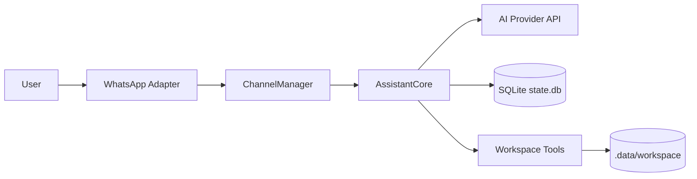
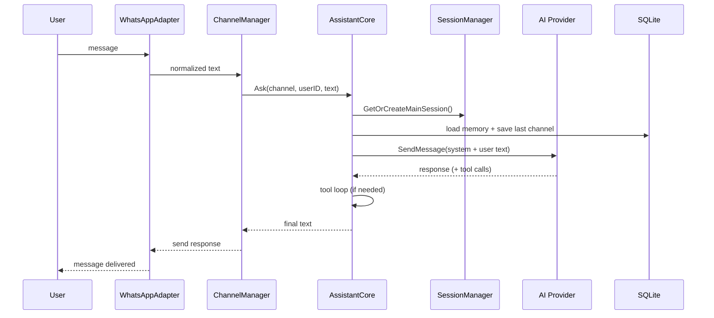
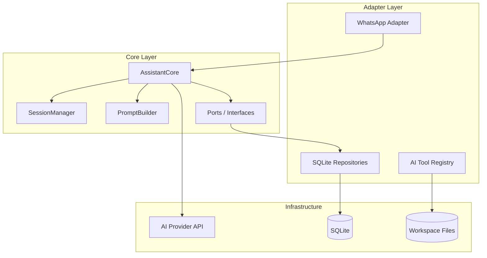

# PocketBrain Architecture Overview

This page explains how PocketBrain works end-to-end, with diagrams and a fast mental model.

## 1) Big Picture

- Goal: one assistant runtime with persistent memory and workspace file management.
- Style: dependency-injected core, adapter-based infrastructure, SQLite state.
- Runtime: single static Go binary, zero runtime dependencies.

## 2) Request Flow (Normal Chat)

## 3) Data Ownership Model

- `.data/workspace/` = long-lived knowledge files.
- `.data/state.db` = runtime state (sessions, memory, whitelist, outbox, heartbeat tasks).
- Content stays in files, operational state stays in SQLite.

## 4) Core Components

- `main.go` / `cmd/` — entry point and Cobra CLI.
- `internal/app/app.go` — composition root, wires all dependencies.
- `internal/core/assistant.go` — orchestrates prompts/sessions/memory context.
- `internal/core/session.go` — main + heartbeat session lifecycle.
- `internal/scheduler/heartbeat.go` — periodic tasks with retry and notification.
- `internal/workspace/workspace.go` — file operations with path security.
- `internal/store/db.go` — SQLite schema bootstrapping.

## 5) Layer Map

## 6) Why This Architecture Is Practical

- Easy to reason about: composition root + explicit dependencies.
- Testable: core depends on ports, tests can mock adapters.
- Single static binary: zero runtime dependencies, easy deployment.
- Reliable operations: outbox retries + heartbeat retries + WAL SQLite.

## 7) Where To Read Next

- Coding architecture: `docs/architecture/coding-architecture.md`
- Security model: `docs/architecture/security-threat-model.md`
- Developer setup: `docs/runbooks/dev-setup.md`
