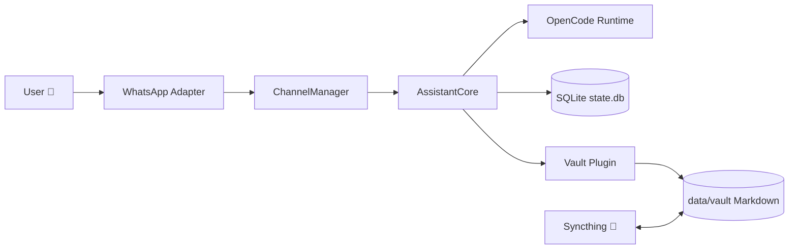
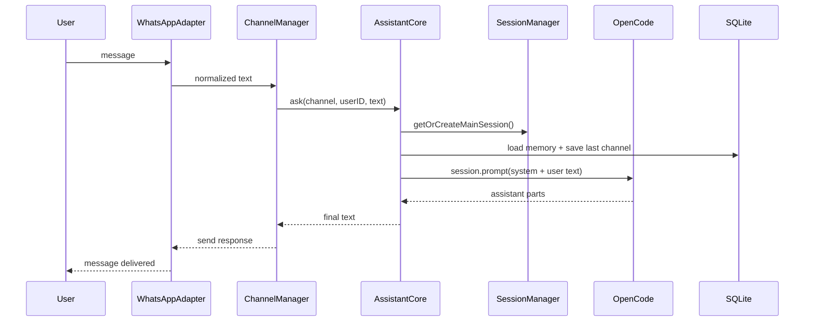
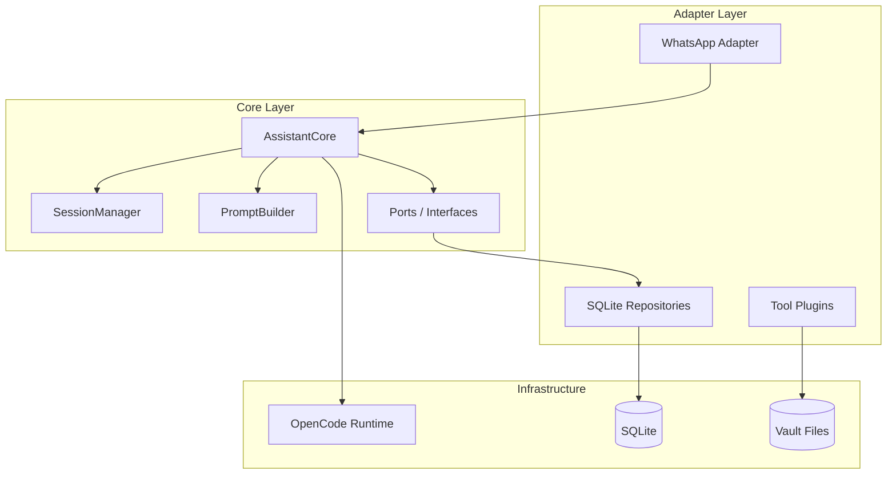

# PocketBrain Architecture Overview 🧠

This page explains how PocketBrain works end-to-end, with diagrams and a fast mental model.

## 1) Big Picture

- 🎯 Goal: one assistant runtime with persistent memory + synced markdown vault.
- 🧱 Style: dependency-injected core, adapter-based infrastructure, SQLite state.
- 📦 Runtime services: `pocketbrain`, `syncthing`, `tailscale`.

## 2) Request Flow (Normal Chat)

## 3) Data Ownership Model

- 🗂️ `data/vault/` = your long-lived knowledge (Markdown, editor-friendly).
- 🧾 `data/state.db` = runtime/application state (sessions, memory, whitelist, outbox, heartbeat tasks).
- 🔐 Clear boundary: content stays in files, operational state stays in SQLite.

## 4) Core Components

- `src/index.ts` — composition root, wires dependencies.
- `src/core/assistant.ts` — orchestrates prompts/sessions/memory context.
- `src/core/session-manager.ts` — main + heartbeat session lifecycle.
- `src/scheduler/heartbeat.ts` — periodic tasks with retry and notification.
- `src/vault/vault-service.ts` — vault reads/writes/search/backlinks/tags.
- `src/store/db.ts` — SQLite schema bootstrapping.

## 5) Layer Map

## 6) Why This Architecture Is Practical ✅

- 😌 Easy to reason about: composition root + explicit dependencies.
- 🧪 Testable: core depends on ports, tests can mock adapters.
- 📝 PKM-friendly: Markdown vault remains tool-agnostic (Obsidian/VSCode).
- 🔁 Reliable operations: outbox retries + heartbeat retries + WAL SQLite.

## 7) Where To Read Next

- Repo structure contract: `docs/architecture/repository-structure.md`
- Security model: `docs/architecture/security-threat-model.md`
- Dev onboarding: `docs/setup/developer-onboarding.md`
